# Documentation technique de l'application de billetterie en ligne des Jeux Olympiques

## Introduction

- **But du projet**
Remplacer les billets physiques, susceptibles de fraude, par un système de billets électroniques sécurisé. Les visiteurs achètent leurs billets en ligne et reçoivent les QR Codes en garantissant l'authenticité par email.

- **Périmètre fonctionnel**
Consultation des offres, panier d'achat et authentification, génération de deux clés (utilisateur / billet) concaténées et encodées en QR Code. Espace Administrateur pour la gestion des offres et la consultation des statistiques de vente.

## Architecture générale


## Modèle de données (schèma relationnel)



## Endpoints de l'API

*[Documentation interactive de l'API](https://studi-exam-jo.lois-kouninef.eu/docs)*

## Sécurité

- Stockage des mots de passe : librairie bcrypt (salt = 10)
- Clès secrètes : secret_key (utilisateur) : uuid, générée automatiquement à l'inscription. hashed_token (billet) : uuid, générée automatiquement à l'achat, unique à chaque billet. Chiffrement avec le module NodeJS crypto avant le stockage en BDD.
- Authentification : Passport avec stratégie Sessions
- Autorisation Guards NestJS pour les rôles (admin, staff, customer) et l'accès restreint aux donénes personnelles.
- Validation : DTOs avec class-validator pour tous les inputs.
- CSRF / XSS : CORS configuré, Content-Security-Policy

## Mise en place de l'environnement de développement

- **Prérequis** : NodeJS >= 18, PostgreSQL >= 13, Docker et Docker Compose.
- **Installation**

```bash
git clone git@github.com:LoisKOUNINEF/paris-2024.git
cd paris-2024

touch .env
# variables d'environnement: DB_HOST, DB_NAME, DB_PORT, DB_USER, DB_PASSWORD, STRIPE_PUBLISHABLE_KEY, STRIPE_SECRET_KEY, SMTP_HOST, SESSION_SECRET, ALLOWED_URL, SERVER_PORT

npm install

# Exécution des migrations
nx run server-data-source:migration-run

# Démarre les applications (front / back) en mode développement
nx run-many --target=serve
```
